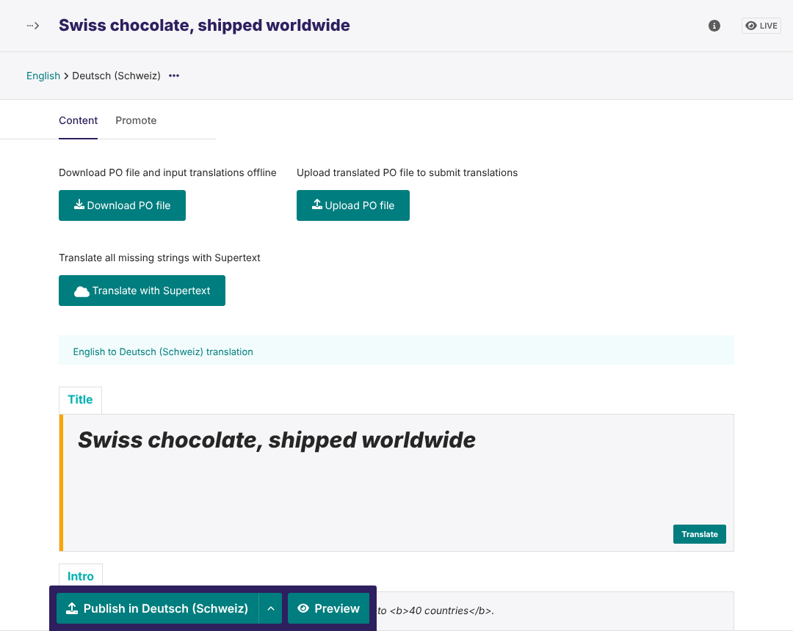

# Supertext Translation for Wagtail

Translate Wagtail pages and snippets with **Supertext AI**, right inside [wagtail-localize](https://wagtail-localize.org/), Wagtail's translation editor.

Open a page, choose **Translate this page**, pick the languages, and click **Translate with Supertext** in the translation editor. Every missing string of the page is translated in one request per language; you review, adjust and publish as usual.

- A wagtail-localize machine translator: no new screens for editors to learn
- Whole paragraphs go to Supertext with their bold, italic and link markup, so sentences translate naturally
- Translated page slugs, so translated pages get translated URLs
- Formal or informal tone and custom Supertext language codes per locale
- *Settings → Supertext* in the admin shows the configuration and tests the API key



## Documentation

| Guide | For |
| --- | --- |
| [Installation guide](docs/INSTALLATION.md) | Administrators and developers: requirements, install, API key, locales, settings, troubleshooting |
| [User guide](docs/USER_GUIDE.md) | Editors: translating, reviewing, what gets translated |
| [Developer guide](docs/DEVELOPER.md) | Architecture, API protocol, local development, tests, demo deployment, releases |

Quick start (you need a Supertext account, [create one here](https://www.supertext.com/person/en/account/signin), and an API key from [supertext.com → Integrations → API](https://www.supertext.com/en/integrations/api), which requires the Admin role):

```python
# settings.py (wagtail-localize already set up)
INSTALLED_APPS += ["wagtail_supertext"]
WAGTAILLOCALIZE_MACHINE_TRANSLATOR = {
    "CLASS": "wagtail_supertext.SupertextTranslator",
    "OPTIONS": {"API_KEY": os.environ["SUPERTEXT_API_KEY"]},
}
```

## Demo

`demo/` is a Wagtail 8 site with an English sample page and German, French and Italian (Switzerland), deployed to Railway from this repository. See the [developer guide](docs/DEVELOPER.md#demo-railway).

## Changelog and roadmap

See [CHANGELOG.md](CHANGELOG.md) and the [roadmap](docs/DEVELOPER.md#known-limitations--roadmap).

<!-- supertext-plugins:start (shared list, keep identical in every Supertext plugin repo) -->
## Supertext plugins for other systems

Supertext offers AI and professional translation plugins for these systems:

| System | Plugin | What it does |
| --- | --- | --- |
| Adobe Experience Manager | [supertext-aem-connector](https://github.com/Supertext/supertext-aem-connector) | Translation connector for AEM 6.5's Translation Integration Framework |
| Contao | [Contao-Supertext-Translation](https://github.com/Supertext/Contao-Supertext-Translation) | *Translate with Supertext* in the site structure: pages or whole websites into other languages |
| Craft CMS | [CraftCms-Supertext-Translation](https://github.com/Supertext/CraftCms-Supertext-Translation) | Translates entries into your other sites, Matrix and rich text included |
| Directus | [Directus-Supertext-Translation](https://github.com/Supertext/Directus-Supertext-Translation) | *Translate with Supertext* box on the item form, fills the Translations field |
| django CMS | [djangoCMS-Supertext-Translation](https://github.com/Supertext/djangoCMS-Supertext-Translation) | Translates pages and their plugins from the toolbar |
| Drupal | [tmgmt_supertext_ai](https://www.drupal.org/project/tmgmt_supertext_ai) | Supertext AI provider for Drupal's Translation Management Tool (TMGMT), by MD Systems |
| Ghost | [Ghost-Supertext-Translation](https://github.com/Supertext/Ghost-Supertext-Translation) | Tag a post `#translate-…` and a translated draft appears |
| Grav | [Grav-Supertext-Translation](https://github.com/Supertext/Grav-Supertext-Translation) | Supertext panel in Grav 2's page editor, Markdown kept intact |
| Joomla | [Joomla-Supertext-Translation](https://github.com/Supertext/Joomla-Supertext-Translation) | Translates articles into linked, unpublished language versions |
| Neos | [Neos-Supertext-Translation](https://github.com/Supertext/Neos-Supertext-Translation) | Translates automatically when an editor creates a page in another language |
| Orchard Core | [OrchardCore-Supertext-Translation](https://github.com/Supertext/OrchardCore-Supertext-Translation) | Translates content items into other cultures, on demand or on localization |
| Payload CMS | [Payload-Supertext-Translation](https://github.com/Supertext/Payload-Supertext-Translation) | *Translate* button for localized collections and globals |
| Silverstripe | [Silverstripe-Supertext-Translation](https://github.com/Supertext/Silverstripe-Supertext-Translation) | Supertext tab translates pages and Elemental blocks into Fluent locales |
| Strapi | [Strapi-Supertext-Translation](https://github.com/Supertext/Strapi-Supertext-Translation) | Translates entries into other locales from the Content Manager |
| TYPO3 | [Typo3-Supertext-Translation](https://github.com/Supertext/Typo3-Supertext-Translation) | Translates pages and content elements as editors localize them |
| Umbraco | [Umbraco-Supertext-Translation](https://github.com/Supertext/Umbraco-Supertext-Translation) | *Translate with Supertext* for pages, block lists and grids included |
| Wagtail | [Wagtail-Supertext-Translation](https://github.com/Supertext/Wagtail-Supertext-Translation) | Machine translator for wagtail-localize |
| WordPress (Polylang) | [supertext-wordpress-polylang](https://github.com/Supertext/supertext-wordpress-polylang) | Supertext as Polylang Pro's machine-translation service, plus professional translation orders |
<!-- supertext-plugins:end -->

## License

BSD 3-Clause (like Wagtail). © Supertext AG
