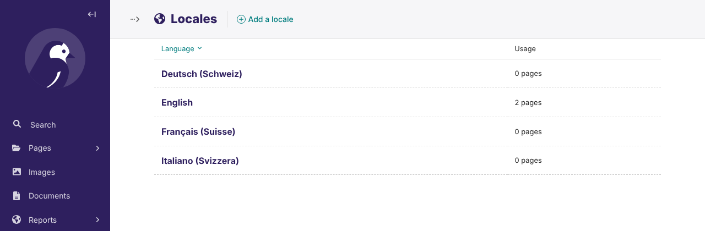

# Installation guide — Supertext Translation for Wagtail

For administrators and developers adding Supertext to a Wagtail site.

## Just want to try it?

`demo/` is a ready-to-run Wagtail 8 site with English sample content, German, French and Italian (Switzerland), wagtail-localize and this package. It is also what runs the public Supertext demo. See the *Demo* section of the [developer guide](DEVELOPER.md#demo-railway).

## Requirements

| | |
| --- | --- |
| Wagtail | 8.0 (tested), 7.0–7.4 (tested in CI) |
| wagtail-localize | 1.12 or newer |
| Python | 3.10 or newer (whatever your Wagtail needs) |
| Supertext | An account ([create one or log in](https://www.supertext.com/person/en/account/signin)) and an API key ([supertext.com → Integrations → API](https://www.supertext.com/en/integrations/api), needs the Admin role). See [Getting a Supertext account and API key](#getting-a-supertext-account-and-api-key). |
| Network | The server must reach `https://api.supertext.com` over HTTPS |

This package is a machine translator **for wagtail-localize**. If your site doesn't use wagtail-localize yet, set it up first: [wagtail-localize installation](https://wagtail-localize.org/stable/how-to/installation/). That includes `WAGTAIL_I18N_ENABLED = True`, `WAGTAIL_CONTENT_LANGUAGES` and making your page models translatable (Wagtail pages are by default).

## 1. Install the package

The package isn't on PyPI yet. Install it from GitHub:

```bash
pip install "wagtail-supertext-translation @ git+https://github.com/Supertext/Wagtail-Supertext-Translation@main"
```

## 2. Configure it

In your Django settings:

```python
import os

INSTALLED_APPS = [
    # ...
    "wagtail_supertext",          # adds Settings → Supertext and the supertext_check command
    "wagtail_localize",
    "wagtail_localize.locales",
    # ...
]

WAGTAILLOCALIZE_MACHINE_TRANSLATOR = {
    "CLASS": "wagtail_supertext.SupertextTranslator",
    "OPTIONS": {
        "API_KEY": os.environ.get("SUPERTEXT_API_KEY", ""),
    },
}
```

wagtail-localize uses one machine translator per site; this replaces DeepL or Google if you had one configured.

### Getting a Supertext account and API key

1. **No Supertext account yet?** [Create one at supertext.com](https://www.supertext.com/person/en/account/signin) (the same page logs you in if you already have one).
2. **Generate your API key** at [supertext.com → Integrations → API](https://www.supertext.com/en/integrations/api). This requires the **Admin** role in your Supertext account; ask your Supertext account admin if you don't see the page.

**API key:** set the environment variable **`SUPERTEXT_API_KEY`** on the server. It always takes precedence over `API_KEY`, and keeps the key out of your code. You can use the key exactly as Supertext shows it, with the leading `Supertext-Auth-Key`, or without it.

## 3. Check it works

As a superuser, open **Settings → Supertext** in the Wagtail admin and click **Test connection**. *Connected. The API key works.* means everything is in place. The page also shows the installed plugin version (linked to its release notes on GitHub) and lists which Supertext language code and tone each locale gets.


From the command line:

```bash
python manage.py supertext_check
```

## 4. Locales

Supertext translates into the site's **locales** (*Settings → Locales*, from `WAGTAIL_CONTENT_LANGUAGES`). Each locale's language code becomes the Supertext target language, with the region in capitals: `de-ch` → `de-CH`, `fr` → `fr`.



### Language codes and tone

Per locale (keyed by its Wagtail language code) you can send a different code to Supertext, and choose the tone:

```python
"OPTIONS": {
    "API_KEY": os.environ.get("SUPERTEXT_API_KEY", ""),
    "LANGUAGES": {
        "fr": {"code": "fr-CH", "politeness": "more"},  # Swiss French, formal (vous)
        "de": {"code": "de-CH", "politeness": "less"},  # Swiss German, informal (du)
    },
},
```

`politeness`: `more` = formal (*Sie, vous*), `less` = informal (*du, tu*), otherwise Supertext's default.

## Who can translate

wagtail-localize's own permissions apply: editors need **Can submit translation** (*Settings → Groups → Wagtail Localize*) and edit permission on the pages. Anyone who can edit a translation can use **Translate with Supertext** in it. *Settings → Supertext* is for superusers only.

## Interface languages

*Settings → Supertext* and the plugin's messages are available in English, German, French and Italian. They follow each user's Wagtail admin language (*Account → Preferences → Preferred language*; `WAGTAILADMIN_PERMITTED_LANGUAGES` limits the choice). Other languages fall back to English. The `manage.py supertext_check` output is English only.

## All settings (`OPTIONS`)

| Option | Default | Purpose |
| --- | --- | --- |
| `API_KEY` | – | Supertext API key, with or without the `Supertext-Auth-Key` prefix. The `SUPERTEXT_API_KEY` environment variable wins. |
| `ENVIRONMENT` | `"live"` | `"live"`, `"staging"` or `"testing"` Supertext API |
| `ENDPOINT` | – | Custom API base URL (overrides `ENVIRONMENT`). The `SUPERTEXT_API_ENDPOINT` environment variable wins. |
| `LANGUAGES` | `{}` | Per Wagtail language code: `code` (Supertext language) and `politeness` (`more`/`less`) |
| `TIMEOUT` | `180` | Seconds to wait for one translation |
| `POLL_INTERVAL` | `2` | Seconds between status checks |

## Updating

```bash
pip install -U "wagtail-supertext-translation @ git+https://github.com/Supertext/Wagtail-Supertext-Translation@main"
```

There are no database migrations.

## Uninstalling

Remove `WAGTAILLOCALIZE_MACHINE_TRANSLATOR` (or point it at another translator), remove `"wagtail_supertext"` from `INSTALLED_APPS`, then `pip uninstall wagtail-supertext-translation`. Existing translations stay.

## Troubleshooting

| Message / symptom | Cause / fix |
| --- | --- |
| No **Translate with Supertext** button in the translation editor | `WAGTAILLOCALIZE_MACHINE_TRANSLATOR` isn't set to `wagtail_supertext.SupertextTranslator`. *Settings → Supertext* shows a warning then. The button is also missing when source and target end up as the same Supertext language. |
| *No Supertext API key is configured* | Set `SUPERTEXT_API_KEY` (or `API_KEY`) and restart. No key yet? Generate one at [supertext.com → Integrations → API](https://www.supertext.com/en/integrations/api) (Admin role). |
| *Authentication failed* | The key is wrong or revoked. Check it with **Test connection**, or generate a new one at [supertext.com → Integrations → API](https://www.supertext.com/en/integrations/api). |
| *Too many requests to Supertext* | Supertext's per-second limit was still exceeded after 4 automatic retries. Wait a moment and try again. |
| *Your Supertext translation limit is exceeded* | Your Supertext plan's volume is used up. |
| *Timed out waiting* | Very long pages: raise `TIMEOUT`, and your web server's request timeout (e.g. gunicorn `--timeout`). |
| *Could not reach Supertext* | The server can't make outbound HTTPS calls; check firewall or proxy (`HTTPS_PROXY`). |

Errors are shown to the editor in the translation editor and logged by Django.

## Security notes

- Prefer the `SUPERTEXT_API_KEY` environment variable: the key then never sits in your repository.
- Documents are deleted from Supertext right after download (and expire after 24 hours anyway).
