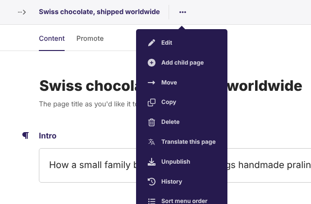
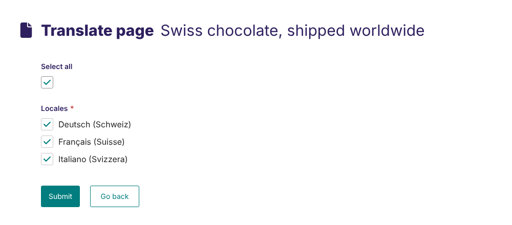
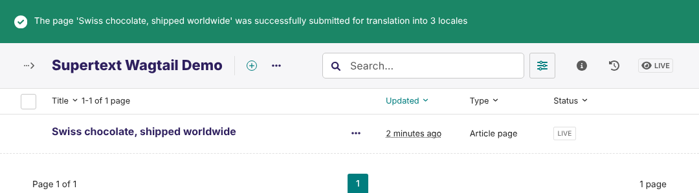
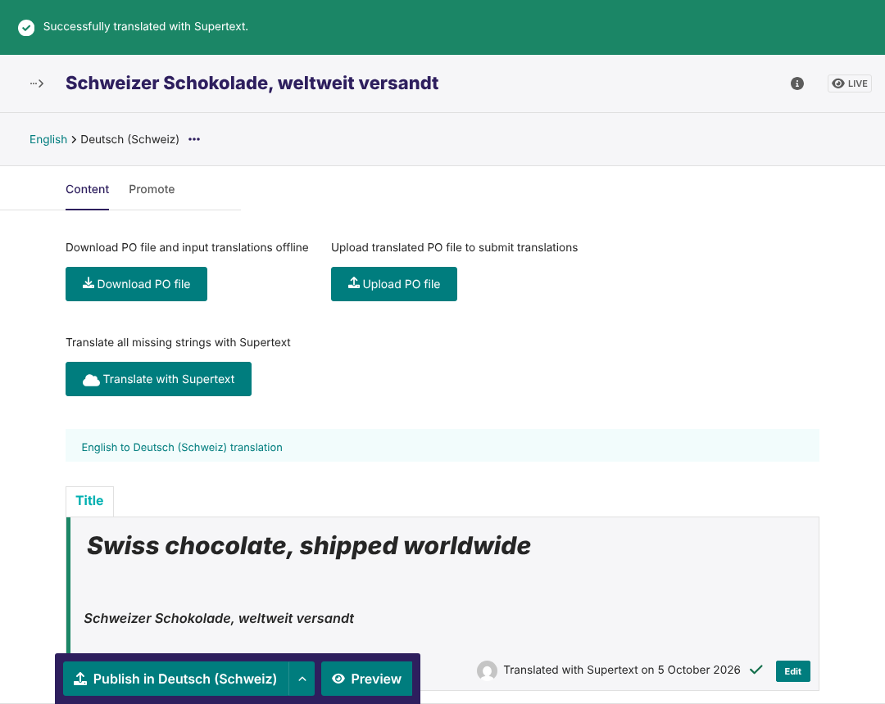
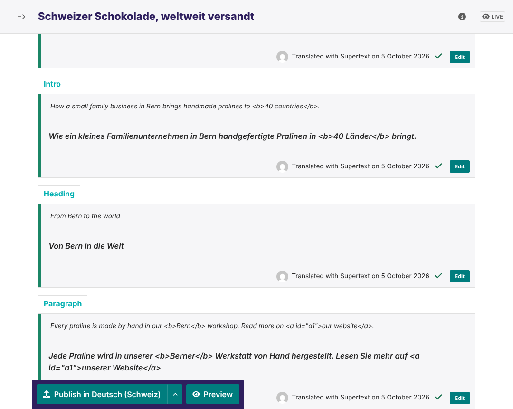
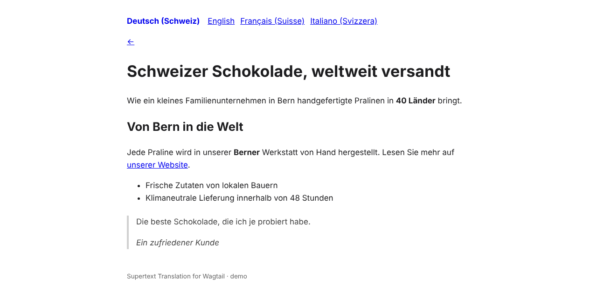

# User guide — Supertext Translation for Wagtail

For editors. Your site translates pages with **wagtail-localize**, Wagtail's translation tool; Supertext fills in the translations for you. You review them and publish.

## Try it on the demo

The Supertext Wagtail demo (ask Supertext for the address and a login) has an English home page and article, and German, French and Italian (Switzerland) as further languages. Translate the article as described below, publish, and switch languages at the top of the page on the site.

## Translate a page

*Screenshots: Wagtail 8 with the demo content.*

1. Open the page in the editor, click **⋯** (More actions) at the top and choose **Translate this page**.

   

2. Tick the languages (or **Select all**) and click **Submit**. To translate a whole section, tick *Include subtree* if it's offered.

   

   Wagtail creates a draft of the page in each language and confirms it.

   

3. Open the page in one of the new languages (e.g. via the language menu next to the title). This is the **translation editor**: every text of the page in English, with a slot for its translation.

   

4. Click **Translate with Supertext**. After a few seconds all texts are filled in, marked *Translated with Supertext*.

   

   Formatting and links stay in place:

   

5. Check the texts. To change one, click **Edit** next to it. Then click **Publish in Deutsch (Schweiz)** (or save a draft).

   

Repeat steps 3–5 for the other languages.

## When the English page changes

After editing the original, open the translation and choose **Sync translated pages** (in the original's **⋯** menu) or update the translation. New or changed texts appear untranslated; **Translate with Supertext** translates **only those**. Texts that already have a translation, including ones you edited, are never overwritten. To have Supertext translate a text again, clear its translation (**Edit** → delete the text → save) and click **Translate with Supertext**.

## What gets translated

Everything wagtail-localize offers for translation: titles, rich text (whole paragraphs, with bold, italic and links kept), text fields, StreamField blocks, SEO and search texts, and snippets that are set up for translation. The page's URL slug is translated too, so the German page gets a German URL.

## What is *not* translated

- Images, documents, link targets, numbers and dates: wagtail-localize keeps them from the original (or lets you choose another image per language).
- Fields your developers marked as not translatable.
- Texts that already have a translation.

## Formal and informal language

Your administrator sets per language whether Supertext writes formally (*Sie/vous*) or informally (*du/tu*).

## When something goes wrong

If Supertext can't translate, the translation editor shows a red message starting with *Supertext could not translate*; nothing is changed, so you can try again.

| Message | What to do |
| --- | --- |
| *No Supertext API key is configured* | Ask your administrator to set up Supertext. The message links to the page where a Supertext admin generates the key ([supertext.com → Integrations → API](https://www.supertext.com/en/integrations/api)). |
| *Authentication failed* | The API key is wrong; ask your administrator to generate a new one at [supertext.com → Integrations → API](https://www.supertext.com/en/integrations/api). |
| *Too many requests to Supertext* | Wait a moment and try again. |
| *Your Supertext translation limit is exceeded* | Your organisation's Supertext volume is used up; contact your administrator. |
| *There isn't anything left to translate* | All texts already have a translation. |
| *Timed out waiting …* | Very long page: try again, or ask your administrator to raise the timeout. |
